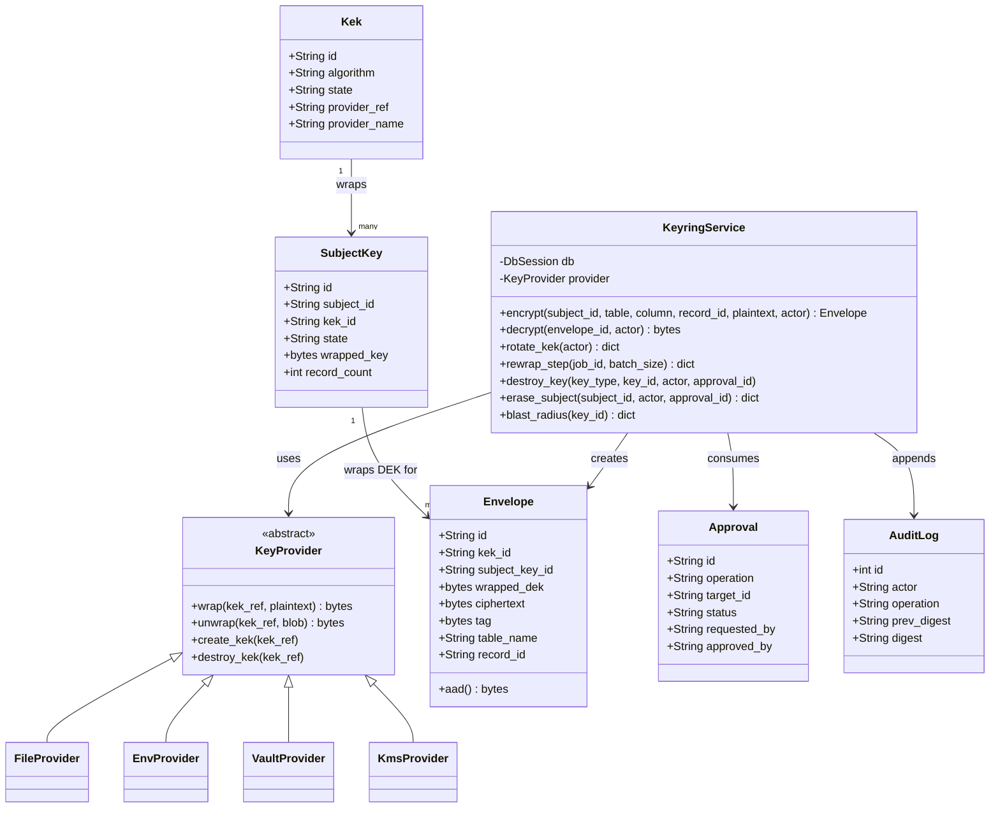
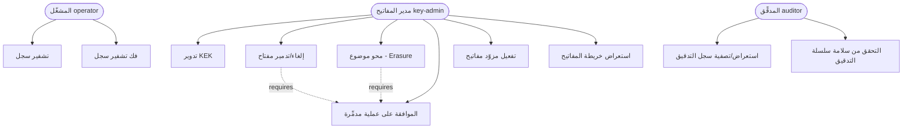
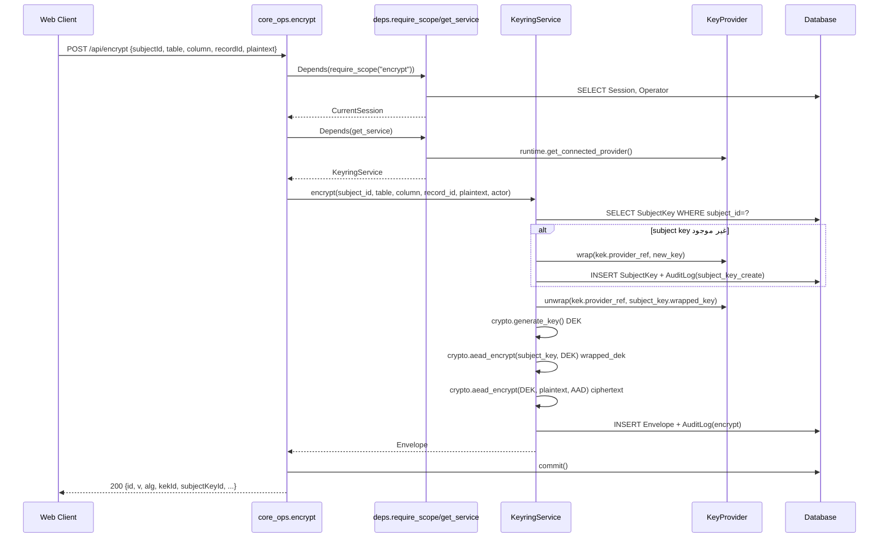
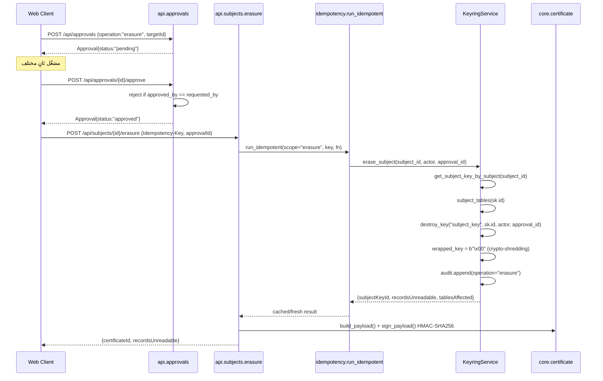
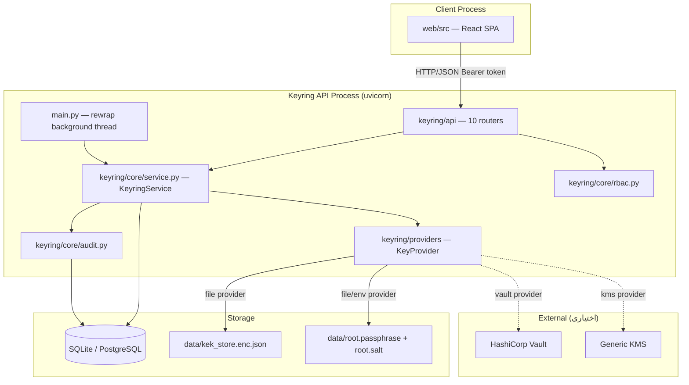
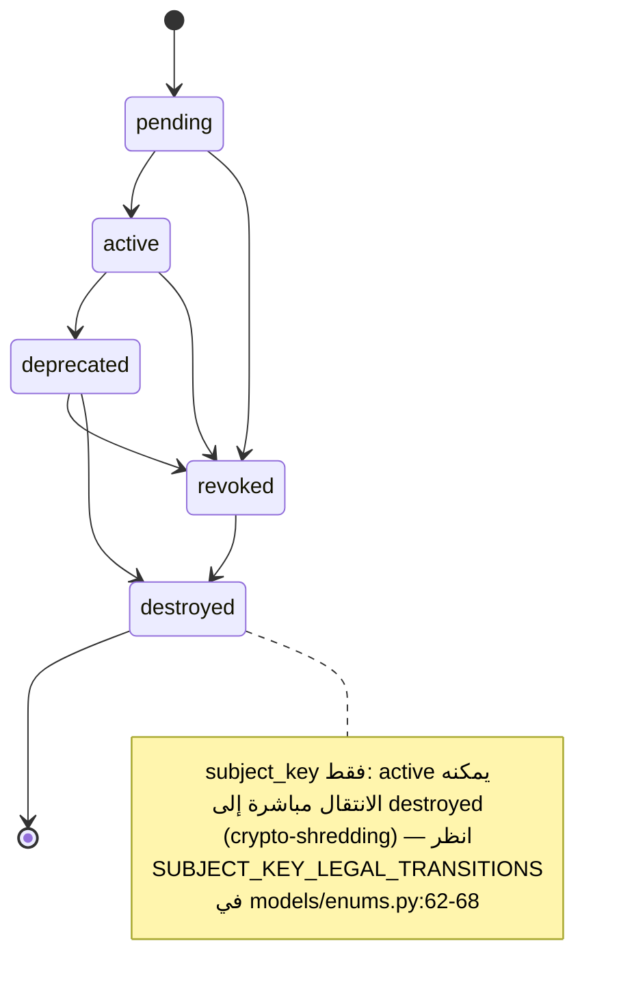

# 03 — المعمارية (Architecture)

## 1. طبقات النظام

النظام مبني على أربع طبقات خلفية داخل عملية Python واحدة، بالإضافة إلى طبقة عميل منفصلة (`web/`):

| الطبقة | الدليل | المسؤولية | لا تعرف عن |
|---|---|---|---|
| **النقل (Transport / API)** | `keyring/api/` | استقبال طلبات HTTP، تفكيك/تحقُّق الجسم عبر Pydantic (`schemas.py`)، فرض المصادقة/التخويل عبر `Depends`، تحويل النتائج إلى JSON عبر `serializers.py` | لا تلمس مفاتيح خام أو منطق تشفير مباشرة |
| **الأعمال (Domain / Core)** | `keyring/core/` | كل منطق التشفير، دورة حياة المفاتيح، RBAC، التدقيق، Shamir، الشهادات — `KeyringService` (`core/service.py:51`) هي الواجهة الموحَّدة الوحيدة التي تُستدعى من طبقة API | لا تعرف تفاصيل HTTP (status codes، headers) |
| **تجريد المزوّد (Provider)** | `keyring/providers/` | الطبقة الوحيدة المسموح لها بفتح/إغلاق اتصال بمصدر السر الجذري وتنفيذ wrap/unwrap فعلي على KEK | لا تعرف شيئاً عن DEKs أو الأظرف (envelopes) أو قاعدة البيانات |
| **البيانات (Model / ORM)** | `keyring/models/` + `keyring/db.py` + `alembic/` | تعريف الجداول، القيود، الفهارس؛ Alembic يملك المخطط (schema) بشكل كامل — لا `create_all()` في التطبيق | لا تعرف شيئاً عن التشفير أو RBAC |
| **العميل (Web Console)** | `web/src/` | واجهة تشغيلية (SPA) تستهلك الـ API فقط عبر HTTP/JSON، بلا أي استيراد مباشر لكود بايثون | لا تنفّذ أي منطق تشفيري؛ التخويل الحقيقي يبقى في الخادم |

توثيق `THREAT_MODEL.md:22-44` يرسم نفس الفصل صراحةً كحدود ثقة (trust boundaries): طبقة `KeyringService`
هي "الطبقة الوحيدة التي تحمل مفتاحاً خاماً على الإطلاق"، وطبقة `KeyProvider` هي "الكود الوحيد الذي
يفكّ تغليف KEK".

## 2. تدفّق الطلب (Request Flow) — مثالان كاملان بأسماء حقيقية

### مثال 1: تشفير سجل (`POST /api/encrypt`)

1. **العميل** — `web/src/api/client.ts:74-101` يبني الطلب: يضيف `Authorization: Bearer <token>`،
   `Accept-Language`، `Content-Type: application/json`، ويستدعيه `web/src/api/endpoints.ts` (دالة
   `encrypt`).
2. **التوجيه** — FastAPI يطابق المسار إلى `encrypt()` في `keyring/api/core_ops.py:23-34` (مسجَّل عبر
   `app.include_router(core_ops.router)` في `keyring/main.py:117`).
3. **حقن الاعتماديات (Dependency Injection)**:
   - `require_scope("encrypt")` (`keyring/api/deps.py:52-58`) → يستدعي `get_current_session`
     (`deps.py:30-49`) الذي يقرأ رأس `Authorization`، يجلب صف `Session` من قاعدة البيانات، يتحقق من
     عدم القفل وعدم انتهاء الصلاحية، ثم يتحقق `rbac.has_scope(role, "encrypt")` من
     `keyring/core/rbac.py:26-27`.
   - `get_service` (`deps.py:61-66`) → يستدعي `runtime.get_connected_provider()`
     (`keyring/core/runtime.py:47`) ويبني `KeyringService(db, provider)`.
   - جسم الطلب يُحقَّق عبر Pydantic في `EncryptBody` (`keyring/api/schemas.py`).
4. **منطق الأعمال** — `core_ops.encrypt` (`core_ops.py:29-32`) يستدعي
   `KeyringService.encrypt(...)` (`keyring/core/service.py:329-354`):
   - `_get_or_create_subject_key` (`service.py:306-328`) — يبحث عن `SubjectKey` قائم، وإن لم يوجد
     يُنشئ واحداً جديداً: `crypto.generate_key()` عشوائي، `self.provider.wrap(...)` لتغليفه تحت الـKEK
     النشط، ثم `audit.append(operation="subject_key_create")`.
   - توليد DEK عشوائي جديد جديد لكل استدعاء (`crypto.generate_key()`، `service.py:333`)، تغليفه تحت
     مفتاح الموضوع عبر `crypto.aead_encrypt` (`service.py:335`)، ثم تشفير النص الصريح الفعلي بنفس
     الـDEK (`service.py:337`) مع AAD مبني من `crypto.build_aad(table, column, record_id,
     subject_id)`.
   - بناء صف `Envelope` جديد (`service.py:340-345`) وإضافته للجلسة، ثم
     `audit.append(operation="encrypt", ...)` (`service.py:350-353`).
5. **الاستجابة** — `service.db.commit()` (`core_ops.py:33`)، ثم `serializers.envelope_public(env)`
   (`keyring/api/serializers.py`) يحوّل الصف إلى `dict` JSON، يُعاد للعميل.

### مثال 2: محو موضوع (Subject Erasure) — `POST /api/subjects/{subject_id}/erasure`

1. **العميل** يستدعي `POST /api/approvals` أولاً لإنشاء طلب موافقة (`keyring/api/approvals.py:41-42`)،
   يُظهره `DestroyFlowDialog.tsx` (`web/src/components/DestroyFlowDialog.tsx:56-66`) الذي يستطلع
   (polls) كل 2.5 ثانية حتى تتم الموافقة من مشغِّل ثانٍ مختلف.
2. **موافقة طرف ثانٍ** — `POST /api/approvals/{id}/approve` (`keyring/api/approvals.py:72-73`) يرفض
   الموافقة الذاتية (`approvals.py:81`، `SelfApprovalError`).
3. **تنفيذ المحو** — `erasure()` في `keyring/api/subjects.py:71-92` يتحقق من `Idempotency-Key`
   ومن كون الموافقة `approved` وعمليتها `erasure`، ثم يستدعي عبر `run_idempotent`
   (`keyring/api/idempotency.py:12-28`) الدالة `service.erase_subject(...)`
   (`keyring/core/service.py:564-575`):
   - `get_subject_key_by_subject` — يجلب `SubjectKey` الخاص بالموضوع.
   - `subject_tables` — يجمع أسماء الجداول المتأثرة عبر استعلام `DISTINCT` على `Envelope.table_name`.
   - `destroy_key("subject_key", sk.id, actor, approval_id)` — يُطبَّق تحقق الانتقال الشرعي
     (`keyring/core/lifecycle.py:28`)، ثم يُصفَّر `wrapped_key` إلى `b"\x00"`
     (`service.py:201-206`) — هذا **هو** فعل crypto-shredding: النص المشفَّر (`Envelope.ciphertext`)
     يبقى في قاعدة البيانات دون تغيير، لكن لا يوجد أي مفتاح متبقٍّ لفكّه.
   - `audit.append(operation="erasure", ...)` (`service.py:571-574`).
4. **الشهادة** — طبقة API تبني شهادة محو موقّعة عبر `keyring/core/certificate.py:27-47`
   (`build_payload` ثم `sign_payload` بـHMAC-SHA256)، تُخزَّن في جدول `erasure_certificates`، وتُعاد
   للعميل عبر `GET /api/certificates/{id}` أو تُصدَّر PDF/JSON.

## 3. المكوّنات الرئيسية (Modules)

| المكوّن | المسؤولية | يعتمد على |
|---|---|---|
| `keyring/core/service.py` — `KeyringService` (620 سطراً) | الواجهة المركزية الوحيدة لكل عمليات المفاتيح: دورة حياة KEK، rewrap، تشفير/فك تشفير (عادي ومتدفّق)، crypto-shredding، blast-radius | `crypto`، `audit`، `lifecycle`، `providers.base.KeyProvider`، كل نماذج `models/` |
| `keyring/core/crypto.py` (223 سطراً) | البدائل التشفيرية الخام فقط: AEAD، HKDF، Argon2id، حارس إعادة استخدام nonce، تصفير الذاكرة | مكتبة `cryptography`، `argon2-cffi` — لا يعتمد على أي طبقة أعلى |
| `keyring/core/rbac.py` | مصفوفة الأدوار→الصلاحيات الثابتة | `models/enums.Role` فقط |
| `keyring/core/lifecycle.py` | فرض انتقالات الحالة الشرعية لكل من KEK وsubject key | `models/enums` (رسوم `KEK_LEGAL_TRANSITIONS`/`SUBJECT_KEY_LEGAL_TRANSITIONS`) |
| `keyring/core/audit.py` | إلحاق مدخل جديد بسجل التدقيق مع سلسلة هاش، والتحقق من سلامة السلسلة | `models/audit.AuditLog` |
| `keyring/core/certificate.py` | بناء/توقيع/تصدير شهادات المحو | `crypto` (HMAC عبر `hmac` القياسية، لا `crypto.py`)، `reportlab` |
| `keyring/core/shamir.py` + `backup.py` | تقسيم/استرجاع السر الجذري واختبار قابلية الاسترجاع | مكتبة `shamir-mnemonic` |
| `keyring/core/runtime.py` | حالة اتصال مزوّد المفاتيح — **عامة على مستوى العملية بأكملها** (متغيّر وحيد `_provider`) | `providers/base.KeyProvider` |
| `keyring/providers/*` | 4 تطبيقات لواجهة `KeyProvider` (file/env/vault/kms) | لكل واحد تبعياته الخاصة (ملف محلي، httpx لـVault/KMS) |
| `keyring/api/deps.py` | سلسلة الاعتماديات المشتركة: جلسة، تخويل، حقن `KeyringService` | `core.rbac`, `core.runtime`, `models.session` |
| `keyring/api/*.py` (10 موجّهات) | نقاط النهاية HTTP، بلا منطق أعمال يتجاوز التنسيق (orchestration) | `deps.py`, `core.service.KeyringService`, `schemas.py`, `serializers.py` |
| `keyring/i18n/translate.py` | تحميل كتالوجات JSON، تفاوض اللغة، دالة `t()` | لا يعتمد على أي طبقة أخرى — مكتبة مستقلة |
| `web/src/api/client.ts` + `endpoints.ts` | كل اتصال HTTP بالخادم من الواجهة، بما في ذلك معالجة الأخطاء الموحَّدة | Fetch API المتصفح فقط |
| `web/src/auth/AuthContext.tsx` | آلة حالة الجلسة (`anonymous/authenticated/locked`)، عدّاد الانتهاء | `api/endpoints.ts` |

## 4. أنماط التصميم (Design Patterns) المستخدَمة فعلياً

### Strategy — مزوّدو المفاتيح القابلون للتبديل
واجهة مجرَّدة واحدة (`KeyProvider(ABC)`) مع أربعة تطبيقات متبادلة دون تغيير أي كود مستهلِك.

```python
# keyring/providers/base.py:18-49
class KeyProvider(ABC):
    name: str

    @abstractmethod
    def wrap(self, kek_ref: str, plaintext: bytes) -> bytes: ...

    @abstractmethod
    def unwrap(self, kek_ref: str, blob: bytes) -> bytes: ...
```
يُختار التطبيق الفعلي في زمن التشغيل عبر `keyring/core/runtime.py:13,30` بناءً على
`KEYRING_PROVIDER`. الاختبار العقدي في `keyring/tests/test_providers.py:1` يُشغِّل نفس مجموعة
الاختبارات على الأربعة تطبيقات دون تعديل — إثبات عملي على تحقُّق النمط.

### Facade / Service Layer — `KeyringService`
كل تعقيد التنسيق بين التشفير وقاعدة البيانات ومزوّد المفتاح مُجمَّع خلف واجهة واحدة بسيطة تستدعيها
طبقة API فقط، بلا أي طبقة API تلمس `provider` أو `bytearray` مباشرة (تعليق توثيقي صريح في
`keyring/core/service.py:3-4`).

```python
# keyring/core/service.py:51
class KeyringService:
    def __init__(self, db: DbSession, provider: KeyProvider): ...
    def encrypt(self, *, subject_id, table, column, record_id, plaintext, actor) -> Envelope: ...
```

### Dependency Injection — سلسلة `Depends` في FastAPI
كل نقطة نهاية تُعلن اعتمادياتها (جلسة، صلاحية، خدمة) كمعاملات دالة، وFastAPI يحقنها زمن التشغيل.

```python
# keyring/api/deps.py:61-66
def get_service(
    db: DbSession = Depends(get_db),
    current: CurrentSession = Depends(get_current_session),
) -> KeyringService:
    provider = runtime.get_connected_provider()
    return KeyringService(db, provider)
```

### State Machine — دورة حياة المفاتيح
رسمان بيانيان صريحان (dict من حالة إلى قائمة حالات مسموحة) يُفرَضان عبر دالة واحدة، فيمنعان أي
انتقال غير شرعي (مثال: `destroyed → active`).

```python
# keyring/models/enums.py:54-60
KEK_LEGAL_TRANSITIONS = {
    "pending": ["active", "revoked"],
    "active": ["deprecated", "revoked"],
    "deprecated": ["revoked", "destroyed"],
    "revoked": ["destroyed"],
    "destroyed": [],
}
```

### معالجة استثناءات مركزية (Centralized Exception Translation)
هرمية استثناءات نطاقية واحدة (`KeyringError`) يلتقطها معالج استثناء FastAPI واحد يترجم الرسالة
حسب لغة الطلب، بدل معالجة كل خطأ في كل نقطة نهاية على حدة.

```python
# keyring/main.py:86-90
@app.exception_handler(KeyringError)
async def keyring_error_handler(request: Request, exc: KeyringError):
    locale = getattr(request.state, "locale", "en")
    message = t(exc.message_key, locale, **{...})
    return JSONResponse(status_code=exc.status_code, content={"code": exc.code, "message": message, **exc.details})
```

## 5. آلية الاتصال بين الأجزاء

**REST/HTTP + JSON فقط** — لا يوجد WebSocket ولا gRPC ولا قائمة رسائل (message queue) في أي مكان
من الكود (تحقُّق: `grep -rniE 'websocket|grpc|rabbitmq|kafka|celery' keyring/ web/src/` لا يُرجع
نتائج تطبيقية؛ حزمة `websockets` موجودة فقط كتبعية انتقالية لـ`uvicorn[standard]` وغير مستخدَمة
مباشرة في الكود — انظر `01_TECH_STACK.md` §3).

**تحديث شبه-حي (polling) بدل push حقيقي**: شاشة `Rewrap.tsx` تستطلع كل 3 ثوانٍ
(`web/src/routes/Rewrap.tsx:32`)، وحوار الموافقة يستطلع كل 2.5 ثانية
(`web/src/components/DestroyFlowDialog.tsx:56-66`). لا SSE (Server-Sent Events) ولا WebSocket.

**تواصل داخل العملية بين الخيط الخلفي والطلبات**: العامل الخلفي `_rewrap_worker_loop`
(`keyring/main.py:26-46`) يعمل في خيط (thread) منفصل داخل نفس عملية Python، يفتح جلسة DB مستقلة
(`SessionLocal()`) في كل دورة، ويتزامن مع بقية النظام فقط عبر حالة الصفوف في قاعدة البيانات
(`RewrapJob.state == "running"`) — لا قناة اتصال مباشرة (queue/pipe) بينه وبين معالِجات HTTP.

## 6. مخططات UML بصيغة Mermaid

### 6.1 مخطط الصفوف (Class Diagram) — الكيانات الأساسية والخدمة



### 6.2 مخطط حالات الاستخدام (Use Case)



### 6.3 مخطط تسلسل (Sequence) — عملية التشفير



### 6.4 مخطط تسلسل (Sequence) — عملية المحو (Erasure)



### 6.5 مخطط مكوّنات (Component)



### 6.6 مخطط حالة (State Diagram) — دورة حياة KEK وsubject key



## 7. ملاحظات معمارية إضافية

- **لا فصل عمليات (multi-process)**: العامل الخلفي وخادم HTTP يعملان في نفس عملية Python (خيط
  منفصل، لا عملية منفصلة)، مما يعني أن قياس الأداء لن يُظهر تحسّناً من إضافة نُسخ (replicas) متعددة
  دون معالجة حالة `runtime.py` العامة على مستوى العملية أولاً (انظر `11_CHALLENGES.md`).
- **لا طبقة Repository منفصلة**: الوصول لقاعدة البيانات يتم مباشرة عبر SQLAlchemy `select()`/
  `db.get()` داخل `KeyringService` نفسها، بلا طبقة تجريد وصول بيانات (Data Access Layer) منفصلة.
- **التسلسل الهرمي لتغليف المفاتيح** (moved from README/THREAT_MODEL، مطابَق مع الكود):
  السر الجذري (خارج القاعدة) → مفتاح تغليف مشتق (Argon2id/HKDF) → KEK (مُخزَّن كـ`provider_ref` فقط)
  → مفتاح الموضوع (`SubjectKey.wrapped_key`، مُغلَّف تحت KEK) → DEK أحادي الاستخدام (مُغلَّف تحت
  مفتاح الموضوع، مُخزَّن داخل `Envelope.wrapped_dek`) → النص المشفَّر الفعلي.
