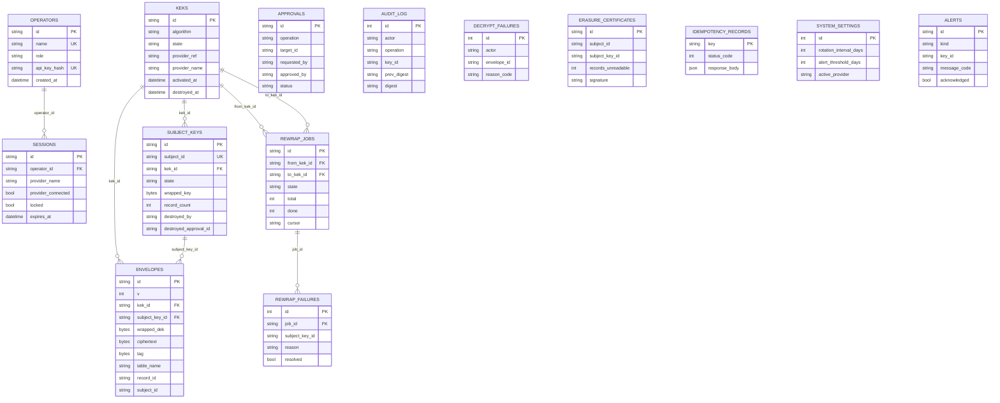

# 04 — قاعدة البيانات (Database)

## 1. نوع قاعدة البيانات وطريقة الوصول

المشروع يستخدم **SQLAlchemy 2.0** كـ ORM (وليس استعلامات SQL خام في أي مكان تقريباً — انظر القسم 6
حول الاستثناءات) فوق قاعدتَي بيانات محتملتين:

- **SQLite** — الافتراضي في بيئة التطوير، ملف `keyring.db` (مبذور بحجم 9.1 MB وقت الاستكشاف).
  الرابط الافتراضي `sqlite:///./keyring.db` (`README.md:16`، `keyring/config.py`).
- **PostgreSQL** — القاعدة المستهدَفة للإنتاج عبر السائق `psycopg[binary]>=3.2`
  (`pyproject.toml:18`)، بتوصية صريحة في `THREAT_MODEL.md:101-106`: "Production deployments should
  run PostgreSQL; SQLite is a development/test convenience only." رقم الإصدار الدقيق المستهدَف
  `[غير موجود في الكود]`.

تعريف الاتصال بالكامل في `keyring/db.py:1-23`:
- `engine = create_engine(settings.database_url, connect_args=connect_args, future=True)` (`db.py:9`)
  — `connect_args={"check_same_thread": False}` يُضاف شرطياً فقط عندما يبدأ الرابط بـ `sqlite`
  (`db.py:8`)، وهو ضبط ضروري لأن SQLite افتراضياً يمنع استخدام الاتصال من خيوط (threads) غير التي
  أنشأته — وهذا مطلوب هنا لأن عامل rewrap الخلفي (`main.py`) يعمل في خيط منفصل عن خيوط طلبات FastAPI.
- `SessionLocal = sessionmaker(bind=engine, autoflush=False, autocommit=False, future=True)` (`db.py:10`).
- `class Base(DeclarativeBase): pass` (`db.py:13-14`) — الأساس الذي ترث منه كل النماذج الأربعة عشر.
- `get_db()` (`db.py:17-22`) دالة توليد (generator) تُستخدَم كـ FastAPI dependency، تفتح جلسة وتُغلقها
  في `finally` بعد كل طلب — نمط "جلسة لكل طلب" القياسي.

لا يوجد pooling مُخصَّص أو إعداد صريح لحجم اتصال القاعدة (`pool_size`, `max_overflow`) — المُعطيات
الافتراضية لـ SQLAlchemy `create_engine` هي ما يُستخدَم فعلياً.

## 2. الجداول (14 جدولاً) — التعريف الكامل

كل جدول مُعرَّف بنموذج SQLAlchemy في `keyring/models/*.py` ومُترجَم إلى SQL في ترحيل Alembic الوحيد
`alembic/versions/e1a463aef094_initial_schema.py`. الأعمدة أدناه مأخوذة مباشرة من النماذج (مصدر
الحقيقة أثناء التطوير) مع مطابقتها لتعريفات `op.create_table` في الترحيل.

### 2.1 `keks`

المصدر: `keyring/models/keys.py:21-50`. تمثّل مفتاح تشفير المفاتيح (Key Encryption Key) — المستوى
الثاني من التسلسل الهرمي للمفاتيح.

| العمود | النوع | القيود | الافتراضي |
|---|---|---|---|
| `id` | `String(36)` | PK | `uuid.uuid4()` (`keys.py:24`) |
| `algorithm` | `String(32)` | NOT NULL | — |
| `state` | `String(16)` | NOT NULL, indexed | `"pending"` (`KeyState.PENDING.value`) |
| `provider_ref` | `String(128)` | NOT NULL | — |
| `provider_name` | `String(16)` | NOT NULL | — |
| `created_at` | `DateTime(timezone=True)` | NOT NULL | `_now()` (UTC) |
| `activated_at` | `DateTime(timezone=True)` | NULLABLE | — |
| `deprecated_at` | `DateTime(timezone=True)` | NULLABLE | — |
| `revoked_at` | `DateTime(timezone=True)` | NULLABLE | — |
| `destroyed_at` | `DateTime(timezone=True)` | NULLABLE | — |

**فهارس**: `ix_keks_state` على `state` (عادي، غير فريد). فهرس جزئي فريد إضافي مهم جداً معمارياً:
`ux_keks_single_active` — `UNIQUE INDEX` على `state` **مشروط** بـ `WHERE state = 'active'`
(مُعرَّف بشرطَي `sqlite_where`/`postgresql_where` منفصلين ليعمل على القاعدتين، `keys.py:27-33`
و`alembic/versions/e1a463aef094_initial_schema.py:113`). هذا يفرض على مستوى قاعدة البيانات نفسها
أن يوجد KEK نشط واحد فقط في كل لحظة (تنفيذ لـ FR-4.2) — وليس مجرد فحص في طبقة الخدمة، بل قيد صلب
لا يمكن كسره حتى لو كان هناك خطأ في منطق التطبيق.

**العلاقة**: `relationship` أحادية الاتجاه إلى `SubjectKey` (`keys.py`، مذكورة في النموذج).

### 2.2 `subject_keys`

المصدر: `keyring/models/keys.py:53-81`. تمثّل مفتاح البيانات لكل "موضوع" (subject) — المستوى الثالث
من التسلسل الهرمي، وهي الوحدة التي يُبنى عليها المحو التشفيري (crypto-shredding).

| العمود | النوع | القيود | الافتراضي |
|---|---|---|---|
| `id` | `String(36)` | PK | `uuid.uuid4()` |
| `subject_id` | `String(128)` | NOT NULL, UNIQUE, indexed | — |
| `kek_id` | `String(36)` | FK → `keks.id`, indexed | — |
| `algorithm` | `String(32)` | NOT NULL | — |
| `state` | `String(16)` | NOT NULL, indexed | `"pending"` |
| `wrapped_key` | `LargeBinary` | NOT NULL | — |
| `record_count` | `Integer` | NOT NULL | `0` |
| `last_access_at` | `DateTime(timezone=True)` | NULLABLE | — |
| `created_at` | `DateTime(timezone=True)` | NOT NULL | `_now()` |
| `activated_at` | `DateTime(timezone=True)` | NULLABLE | — |
| `revoked_at` | `DateTime(timezone=True)` | NULLABLE | — |
| `destroyed_at` | `DateTime(timezone=True)` | NULLABLE | — |
| `destroyed_by` | `String(128)` | NULLABLE | — |
| `destroyed_approval_id` | `String(36)` | NULLABLE | — |
| `destroyed_record_count` | `Integer` | NULLABLE | — |

الحقول الثلاثة الأخيرة (`destroyed_by`, `destroyed_approval_id`, `destroyed_record_count`) موصوفة في
تعليق داخل النموذج (`keys.py:74-79`) بأنها "شاهد المحو" (destruction tombstone) — تُملأ فقط عند
تدمير المفتاح وتبقى دليلاً على متى/من/كم سجلاً تأثر، دون الحاجة لحذف صف `subject_keys` نفسه (الصف
يبقى موجوداً كسجل تدقيق، وحقل `wrapped_key` هو ما يُصفَّر فعلياً عند المحو).

**فهارس**: `ix_subject_keys_kek_id` (FK)، `ix_subject_keys_state`، وفهرس **فريد**
`ix_subject_keys_subject_id` (`unique=True` في `alembic/versions/e1a463aef094_initial_schema.py:179`)
يمنع وجود أكثر من مفتاح فرعي واحد نشط لكل `subject_id`.

### 2.3 `envelopes`

المصدر: `keyring/models/envelope.py:20-55`. الجدول الأكبر عملياً (15,410 صفاً في القاعدة المبذورة) —
كل صف يمثّل قطعة بيانات واحدة مُشفَّرة (عمود واحد في سجل واحد من جدول عمل افتراضي). التعليق التوثيقي
في النموذج يذكر أنه "Mirrors the versioned envelope shape from the spec exactly" (`envelope.py`).

| العمود | النوع | القيود | الافتراضي |
|---|---|---|---|
| `id` | `String(36)` | PK | `uuid.uuid4()` |
| `v` | `Integer` | NOT NULL | رقم إصدار شكل الظرف |
| `alg` | `String(32)` | NOT NULL | — |
| `kek_id` | `String(36)` | FK → `keks.id` | — |
| `subject_key_id` | `String(36)` | FK → `subject_keys.id`, indexed | — |
| `wrapped_dek` | `LargeBinary` | NOT NULL | DEK ملفوف بمفتاح الموضوع |
| `dek_nonce` | `LargeBinary` | NOT NULL | nonce تغليف الـ DEK |
| `data_nonce` | `LargeBinary` | NOT NULL | nonce تشفير البيانات نفسها |
| `ciphertext` | `LargeBinary` | NOT NULL | البيانات المشفَّرة |
| `tag` | `LargeBinary` | NOT NULL | وسم مصادقة AEAD |
| `table_name` | `String(128)` | NOT NULL, indexed | اسم الجدول المصدر المنطقي |
| `column_name` | `String(128)` | NOT NULL | اسم العمود المصدر المنطقي |
| `record_id` | `String(128)` | NOT NULL, indexed | معرّف السجل المصدر المنطقي |
| `subject_id` | `String(128)` | NOT NULL, indexed | — |
| `created_at` | `DateTime(timezone=True)` | NOT NULL | `_now()` |

**الدالة `aad()`** (`envelope.py:52-55`) تُعيد بناء البيانات المُصادَق عليها إضافياً (Additional
Authenticated Data) عبر `crypto.build_aad(self.table_name, self.column_name, self.record_id,
self.subject_id)` — أي أن هوية السجل المنطقي (جدول/عمود/معرّف/موضوع) جزء لا يتجزأ من عملية فك
التشفير نفسها: لا يمكن نقل ciphertext من سجل لآخر واعتباره صالحاً.

**فهارس**: `ix_envelopes_record_id`، `ix_envelopes_subject_id`، `ix_envelopes_subject_key_id`،
`ix_envelopes_table_name` — أربعة فهارس عادية (غير فريدة).

### 2.4 `audit_log`

المصدر: `keyring/models/audit.py:18-35`. سجل تدقيق مسلسل بالهاش (hash-chained)، مذكور صراحة كتنفيذ
لـ FR-8.3 في توثيق النموذج.

| العمود | النوع | القيود | الافتراضي |
|---|---|---|---|
| `id` | `Integer` | PK, autoincrement | — |
| `timestamp` | `DateTime(timezone=True)` | NOT NULL | `_now()` |
| `actor` | `String(128)` | NOT NULL, indexed | — |
| `operation` | `String(32)` | NOT NULL, indexed | — |
| `key_id` | `String(36)` | NULLABLE, indexed | — |
| `item_id` | `String(128)` | NULLABLE | — |
| `result` | `String(16)` | NOT NULL | — |
| `details` | `JSON` | NOT NULL | — |
| `prev_digest` | `String(64)` | NOT NULL | — |
| `digest` | `String(64)` | NOT NULL, indexed | — |

الثابت `GENESIS_DIGEST = "0" * 64` (`audit.py:15`) هو قيمة `prev_digest` للسجل الأول في السلسلة —
كل سجل لاحق يحسب `digest` الخاص به من هاش (`prev_digest` + محتوى السجل)، بحيث أي تعديل على سجل قديم
يكسر كل السلسلة اللاحقة (خاصية سلاسل الهاش القياسية، تُستخدَم هنا لإثبات عدم العبث بسجل التدقيق).

**فهارس**: `ix_audit_log_actor`، `ix_audit_log_digest`، `ix_audit_log_key_id`، `ix_audit_log_operation`.
**ملاحظة**: `key_id` هنا **مرجع نصي حر وليس مفتاحاً أجنبياً (FK) حقيقياً** — لا يوجد
`ForeignKeyConstraint` عليه في الترحيل (`alembic/versions/e1a463aef094_initial_schema.py:56`)،
لأن سجل التدقيق يجب أن يبقى قابلاً للإدراج حتى لو حُذف المفتاح المُشار إليه لاحقاً (وهو ما لا يحدث
فعلياً في هذا النظام لأن الصفوف لا تُحذف أبداً، لكنه تصميم متعمد لفصل سجل التدقيق عن قيود التكامل
المرجعي).

### 2.5 `decrypt_failures`

المصدر: `keyring/models/audit.py:38-49`، موثَّق كتنفيذ لـ FR-8.5.

| العمود | النوع | القيود | الافتراضي |
|---|---|---|---|
| `id` | `Integer` | PK, autoincrement | — |
| `timestamp` | `DateTime(timezone=True)` | NOT NULL | `_now()` |
| `actor` | `String(128)` | NOT NULL, indexed | — |
| `envelope_id` | `String(36)` | NULLABLE, indexed | — |
| `reason_code` | `String(32)` | NOT NULL | — |

**فهارس**: `ix_decrypt_failures_actor`، `ix_decrypt_failures_envelope_id`. لا يوجد FK حقيقي على
`envelope_id` (نفس منطق `audit_log.key_id` أعلاه — سجل فشل يجب أن يُكتَب دائماً بغض النظر عن حالة
الظرف المُشار إليه).

### 2.6 `approvals`

المصدر: `keyring/models/approvals.py:21-40`. سجل موافقات الطرف الثاني على العمليات المدمّرة، موثَّق
كتنفيذ لـ FR-9.3. التعليق التوثيقي يوضّح صراحة (`approvals.py:22-24`) أن `requested_by` و
`approved_by` **يجب أن يختلفا**، وهذا مفروض في طبقة الخدمة (مقارنة هوية الفاعل) وليس بقيد قاعدة
بيانات — أي لا يوجد `CHECK` constraint على ذلك في الترحيل.

| العمود | النوع | القيود | الافتراضي |
|---|---|---|---|
| `id` | `String(36)` | PK | `uuid.uuid4()` |
| `operation` | `String(32)` | NOT NULL, indexed | — |
| `target_id` | `String(128)` | NOT NULL, indexed | — |
| `record_count` | `Integer` | NOT NULL | `0` |
| `requested_by` | `String(128)` | NOT NULL | — |
| `approved_by` | `String(128)` | NULLABLE | — |
| `status` | `String(16)` | NOT NULL, indexed | `"pending"` (`ApprovalStatus.PENDING.value`) |
| `created_at` | `DateTime(timezone=True)` | NOT NULL | `_now()` |
| `decided_at` | `DateTime(timezone=True)` | NULLABLE | — |
| `consumed_at` | `DateTime(timezone=True)` | NULLABLE | — |

**فهارس**: `ix_approvals_operation`، `ix_approvals_status`، `ix_approvals_target_id`. `target_id`
مرجع نصي حر (قد يشير إلى `kek.id` أو `subject_key.id` حسب `operation`) — لا FK حقيقياً لأنه
polymorphic (يشير لجداول مختلفة حسب السياق).

### 2.7 `idempotency_records`

المصدر: `keyring/models/idempotency.py:15-25`. التعليق التوثيقي (`idempotency.py:16-18`) يصفه بأنه
"Replay protection for destructive calls (destroy, erasure)" — مفتاح على `Idempotency-Key` header
الذي يرسله العميل؛ إعادة نفس المفتاح تُعيد نفس جسم/رمز الاستجابة الأصليَين دون إعادة تنفيذ العملية.

| العمود | النوع | القيود | الافتراضي |
|---|---|---|---|
| `key` | `String(128)` | **PK** | — (قيمة مُرسَلة من العميل) |
| `status_code` | `Integer` | NOT NULL | — |
| `response_body` | `JSON` | NOT NULL | — |
| `created_at` | `DateTime(timezone=True)` | NOT NULL | `_now()` |

**ملاحظة بنيوية**: لا يوجد عمود `expires_at`/TTL ولا أي آلية تنظيف (cleanup) لهذا الجدول في أي مكان
من الكود — الصفوف تتراكم إلى الأبد. موثَّقة كملاحظة محايدة في `11_CHALLENGES.md`.

### 2.8 `keks` → `rewrap_jobs`

المصدر: `keyring/models/rewrap.py:20-39`. تنفيذ FR-5.3 — إعادة تغليف قابلة للاستئناف من KEK إلى آخر.
التعليق التوثيقي (`rewrap.py:21-25`) يشرح أن `cursor` هو معرّف آخر `subject_key` تمت معالجته، بترتيب
تصاعدي حسب `id`، بحيث لو قُتلت المهمة (killed) تستأنف دون فجوة أو تكرار.

| العمود | النوع | القيود | الافتراضي |
|---|---|---|---|
| `id` | `String(36)` | PK | `uuid.uuid4()` |
| `from_kek_id` | `String(36)` | FK → `keks.id` | — |
| `to_kek_id` | `String(36)` | FK → `keks.id` | — |
| `state` | `String(16)` | NOT NULL, indexed | `"running"` (قيَم: running/paused/completed/failed) |
| `total` | `Integer` | NOT NULL | `0` |
| `done` | `Integer` | NOT NULL | `0` |
| `cursor` | `String(36)` | NULLABLE | — |
| `created_at` | `DateTime(timezone=True)` | NOT NULL | `_now()` |
| `updated_at` | `DateTime(timezone=True)` | NOT NULL | `_now()`, `onupdate=_now` |

**فهارس**: `ix_rewrap_jobs_state`. هذا الجدول له **مفتاحان أجنبيان يشيران لنفس الجدول** (`keks`) —
`from_kek_id` و`to_kek_id` — وهي علاقة ذاتية الإشارة عبر جدول وسيط منطقياً بين صفَّين من `keks`.

### 2.9 `rewrap_failures`

المصدر: `keyring/models/rewrap.py:42-53`.

| العمود | النوع | القيود | الافتراضي |
|---|---|---|---|
| `id` | `Integer` | PK, autoincrement | — |
| `job_id` | `String(36)` | FK → `rewrap_jobs.id`, indexed | — |
| `item_id` | `String(36)` | NOT NULL | معرّف subject_key (تعليق: "subject_key id") |
| `subject_key_id` | `String(36)` | NOT NULL | — |
| `reason` | `String(256)` | NOT NULL | — |
| `attempts` | `Integer` | NOT NULL | `1` |
| `resolved` | `Boolean` | NOT NULL | `False` |
| `created_at` | `DateTime(timezone=True)` | NOT NULL | `_now()` |

**ملاحظة**: `item_id` و`subject_key_id` يحملان القيمة نفسها فعلياً حسب التعليق (`rewrap.py:47`) —
ازدواجية تسمية داخل النموذج نفسه.

### 2.10 `operators`

المصدر: `keyring/models/session.py:20-30`. التعليق التوثيقي: "A human or service actor. `api_key_hash`
is a SHA-256 digest of the presented key — the raw key is never persisted."

| العمود | النوع | القيود | الافتراضي |
|---|---|---|---|
| `id` | `String(36)` | PK | `uuid.uuid4()` |
| `name` | `String(128)` | NOT NULL, **UNIQUE** | — |
| `role` | `String(16)` | NOT NULL | `operator` \| `key-admin` \| `auditor` |
| `api_key_hash` | `String(64)` | NOT NULL, **UNIQUE** | هاش SHA-256 لمفتاح API |
| `created_at` | `DateTime(timezone=True)` | NOT NULL | `_now()` |

**قيدان فريدان مباشران** على `name` و`api_key_hash` (`UniqueConstraint`، مذكوران أيضاً في الترحيل
`alembic/versions/e1a463aef094_initial_schema.py:121-122`) — لا يمكن وجود عامِلَين بنفس الاسم أو
بنفس هاش المفتاح.

### 2.11 `sessions`

المصدر: `keyring/models/session.py:33-43`.

| العمود | النوع | القيود | الافتراضي |
|---|---|---|---|
| `id` | `String(36)` | PK | `uuid.uuid4()` |
| `operator_id` | `String(36)` | FK → `operators.id` | — |
| `provider_name` | `String(16)` | NOT NULL | — |
| `provider_connected` | `Boolean` | NOT NULL | `True` |
| `locked` | `Boolean` | NOT NULL | `False` |
| `created_at` | `DateTime(timezone=True)` | NOT NULL | `_now()` |
| `expires_at` | `DateTime(timezone=True)` | NOT NULL | — (يُحسب عند الإنشاء من `session_ttl_seconds`) |
| `locked_at` | `DateTime(timezone=True)` | NULLABLE | — |

لا فهرس صريح على `operator_id` رغم أنه FK (لا `index=True` في التعريف ولا `op.create_index` مقابل
في الترحيل) — الفهرس الوحيد الضمني هو الفهرس التلقائي على `PRIMARY KEY(id)`.

### 2.12 `erasure_certificates`

المصدر: `keyring/models/certificate.py:20-35`. التعليق التوثيقي: "Signed deletion certificate
produced by a subject erasure (section 3). `payload` is the exact canonical JSON that `signature`
covers." (الإشارة إلى "section 3" هنا مرجع لمواصفة بناء خارجية غير موجودة في هذا المستودع — موثَّقة
كفجوة في `13_GAPS.md`).

| العمود | النوع | القيود | الافتراضي |
|---|---|---|---|
| `id` | `String(36)` | PK | `uuid.uuid4()` |
| `subject_id` | `String(128)` | NOT NULL, indexed | — |
| `subject_key_id` | `String(36)` | NOT NULL | — |
| `records_unreadable` | `Integer` | NOT NULL | — |
| `tables_affected` | `JSON` | NOT NULL | قائمة أسماء جداول |
| `operator` | `String(128)` | NOT NULL | — |
| `approval_chain` | `JSON` | NOT NULL | — |
| `payload` | `JSON` | NOT NULL | نص JSON القانوني الموقَّع فعلياً |
| `signature` | `String(128)` | NOT NULL | توقيع HMAC-SHA256 (سداسي عشري، 128 محرفاً = 64 بايت مُمثَّلة) |
| `created_at` | `DateTime(timezone=True)` | NOT NULL | `_now()` |

**فهارس**: `ix_erasure_certificates_subject_id`. `subject_key_id` مرجع نصي حر بلا FK حقيقي.

### 2.13 `system_settings`

المصدر: `keyring/models/settings_model.py:20-26`. جدول **مفرد (singleton)** — صف واحد فقط عملياً
(`id` افتراضيه `1`، ولا يوجد كود ينشئ أكثر من صف).

| العمود | النوع | القيود | الافتراضي |
|---|---|---|---|
| `id` | `Integer` | PK | `1` |
| `rotation_interval_days` | `Integer` | NOT NULL | `90` |
| `alert_threshold_days` | `Integer` | NOT NULL | `100` |
| `active_provider` | `String(16)` | NOT NULL | `"file"` |

### 2.14 `alerts`

المصدر: `keyring/models/settings_model.py:29-39`.

| العمود | النوع | القيود | الافتراضي |
|---|---|---|---|
| `id` | `String(36)` | PK | `uuid.uuid4()` |
| `kind` | `String(32)` | NOT NULL | — |
| `key_id` | `String(36)` | NULLABLE | — |
| `message_code` | `String(64)` | NOT NULL | — |
| `created_at` | `DateTime(timezone=True)` | NOT NULL | `_now()` |
| `acknowledged` | `Boolean` | NOT NULL | `False` |
| `acknowledged_at` | `DateTime(timezone=True)` | NULLABLE | — |
| `acknowledged_by` | `String(128)` | NULLABLE | — |

لا فهرس صريح على `key_id` (مرجع نصي حر، بلا FK).

## 3. جدول ميتاداتا Alembic

`alembic_version` — جدول تلقائي من Alembic نفسه (عمود `version_num` فقط)، يحمل حالياً القيمة
`e1a463aef094`. غير مُعرَّف في `keyring/models/` لأنه ليس جزءاً من نموذج التطبيق، بل آلية Alembic
الداخلية لتتبّع أي ترحيل طُبِّق آخراً.

## 4. العلاقات بين الجداول

جميع العلاقات في هذا المخطط من نوع **واحد-إلى-متعدد (1-N)** أو مراجع نصية غير مفروضة (بلا FK) —
**لا توجد أي علاقة متعدد-إلى-متعدد (N-N)** ولا أي جدول وصل (junction table) في المخطط بأكمله.

| من | إلى | نوع | العمود | مصدر FK |
|---|---|---|---|---|
| `operators` | `sessions` | 1-N | `sessions.operator_id` | `session.py:37` |
| `keks` | `subject_keys` | 1-N | `subject_keys.kek_id` | `keys.py:59` (استنتاج من `relationship`)، الترحيل سطر 174 |
| `keks` | `envelopes` | 1-N | `envelopes.kek_id` | الترحيل سطر 196 |
| `subject_keys` | `envelopes` | 1-N | `envelopes.subject_key_id` | الترحيل سطر 197 |
| `keks` | `rewrap_jobs` (مرتين) | 1-N ×2 | `rewrap_jobs.from_kek_id`, `rewrap_jobs.to_kek_id` | الترحيل سطر 141-142 |
| `rewrap_jobs` | `rewrap_failures` | 1-N | `rewrap_failures.job_id` | الترحيل سطر 213 |

**مراجع نصية بلا FK حقيقي** (موثَّقة كملاحظة محايدة، ليست خطأً بالضرورة — قد تكون تصميماً متعمداً
لفصل سجلات التدقيق/الفشل عن قيود التكامل المرجعي كما ذُكِر أعلاه): `audit_log.key_id`،
`decrypt_failures.envelope_id`، `approvals.target_id`، `erasure_certificates.subject_key_id`،
`alerts.key_id`.

## 5. مخطط ERD (Mermaid)

**ملاحظة على المخطط**: الجداول `APPROVALS`, `AUDIT_LOG`, `DECRYPT_FAILURES`, `ERASURE_CERTIFICATES`,
`IDEMPOTENCY_RECORDS`, `SYSTEM_SETTINGS`, `ALERTS` تظهر معزولة بلا أسهم علاقة لأنها فعلياً كذلك في
المخطط الفعلي — مراجعها لجداول أخرى (إن وُجدت) نصية حرة غير مفروضة بقيد FK كما هو موضَّح في القسم 4.

## 6. ملفات الترحيل (Migrations) وترتيبها

**ترحيل واحد فقط** في المشروع بأكمله: `alembic/versions/e1a463aef094_initial_schema.py`.

- `revision = 'e1a463aef094'`، `down_revision = None` (`e1a463aef094_initial_schema.py:15-16`) —
  أي أنه أول وآخر ترحيل، لا يوجد تسلسل ترحيلات متعدد.
- تاريخ الإنشاء المُدوَّن داخل الملف نفسه: `Create Date: 2026-08-23 23:35:58.689721`
  (`e1a463aef094_initial_schema.py:5`).
- محتوى `upgrade()` (الأسطر 21-217) يُنشئ الجداول الأربعة عشر بالترتيب: `alerts`, `approvals`,
  `audit_log`, `decrypt_failures`, `erasure_certificates`, `idempotency_records`, `keks`,
  `operators`, `system_settings`, `rewrap_jobs`, `sessions`, `subject_keys`, `envelopes`,
  `rewrap_failures` — ترتيب ناتج عن أداة `alembic revision --autogenerate` (تعليق تلقائي
  "auto generated by Alembic - please adjust!" في السطر 23) وليس ترتيباً يدوياً مقصوداً.
- محتوى `downgrade()` (الأسطر 220-258) يعكس العملية بترتيب معاكس تماماً — حذف الفهارس ثم الجداول.
- **عدد الفهارس المُنشأة صراحةً عبر `op.create_index`**: 21 فهرساً (بالعدّ المباشر من الملف)، بالإضافة
  إلى الفهارس الضمنية التلقائية على كل `PRIMARY KEY`.

## 7. استعلامات مخصَّصة معقَّدة

لا توجد استعلامات SQL خام (raw SQL / `text()`) في أي مكان بالمشروع — كل الوصول عبر SQLAlemy Core
`select()` مبني عبر ORM. أبرز الاستعلامات من ناحية التعقيد المنطقي (وليس تعقيد صياغة SQL):

**`KeyringService.blast_radius()`** (`keyring/core/service.py:599-620`، مستدعاة من
`GET /api/keys/{key_id}/blast-radius` عبر `keyring/api/keys.py:73-75`) — تحسب "نصف قطر الانفجار"
لمفتاح معيّن: إن كان `key_id` يخص KEK، تجلب أولاً كل معرّفات `subject_keys` التابعة له
(`service.py:602`)، ثم تُشغّل استعلامَي عدّ/تمييز إضافيَّين مبنيَّين على `.in_(sk_ids)`
(`service.py:603-608`) لحساب إجمالي عدد السجلات المتأثرة وأسماء الجداول المتأثرة عبر كل تلك المفاتيح
الفرعية معاً؛ أما إن كان `key_id` يخص `subject_key` مباشرة فتُستخدَم نسخة أبسط بدون خطوة `.in_()`
(`service.py:611-620`). هذا استعلام من ثلاث خطوات متسلسلة (fan-out عبر `subject_keys` ثم تجميع عبر
`envelopes`) وليس استعلام join واحداً — أي أنه ثلاث رحلات منفصلة لقاعدة البيانات بدل استعلام SQL
واحد بـ `JOIN`.

**استعلامات القائمة/التصفح في `GET /api/keys`** (`keyring/api/keys.py:43-64`): تجلب **كل** صفوف
`keks` وكل صفوف `subject_keys` (`select(Kek)` و`select(SubjectKey)` بلا `WHERE` أو `LIMIT` على
مستوى قاعدة البيانات، الأسطر 44 و52)، ثم تُطبَّق التصفية (`state`, `q`) والفرز والتقسيم لصفحات
بالكامل في كود بايثون بعد التحميل (`keys.py:46-63`) — أي لا يوجد `WHERE`/`ORDER BY`/`LIMIT` مُرسَل
فعلياً إلى قاعدة البيانات لهذا المسار، بل تحميل الجدول كاملاً في الذاكرة ثم المعالجة. النمط نفسه
يتكرر في `GET /api/rewrap/failures` (`keyring/api/rewrap.py:69-70`) وإن كان هناك أقل حدّة. هذا نمط
بنيوي مُلاحَظ (وليس عطلاً وظيفياً بالضرورة نظراً لحجم البيانات الحالي) — موثَّق بتفصيل أكبر في
`11_CHALLENGES.md`.

**عدّادات لوحة التحكم `GET /api/dashboard`** (`keyring/api/dashboard.py:42-46`): أربعة استعلامات
`select(func.count()).select_from(...)` منفصلة (على `Kek`, `SubjectKey`, `Envelope`, `Approval`
المُصفَّاة بحالة `pending`) — تُنفَّذ تباعاً وليس عبر استعلام تجميعي واحد متعدد الأعمدة.

## 8. ملخّص فجوات هذا الملف

- نسخة PostgreSQL الدقيقة المستهدَفة للإنتاج — `[غير موجود في الكود]`.
- إعدادات صريحة لـ connection pooling (`pool_size`, `max_overflow`, إلخ) — `[غير موجود في الكود]`،
  القيم الافتراضية لـ SQLAlchemy هي المُستخدَمة فعلياً.
- المرجع الخارجي "section 3" المذكور في تعليقات `certificate.py:21` و`enums.py:52` — مواصفة بناء
  خارجية غير موجودة كملف في هذا المستودع؛ منقول إلى `13_GAPS.md`.
